# Flask E-Commerce Application — Project Documentation

**Course:** Cloud Computing (UCBX)
**Author:** Tanner Young
**Repository:** https://github.com/tlycode/tanner-young-cloud-project
**Date:** August 2026

---

## Table of Contents

1. [Project Overview](#1-project-overview)
2. [Application Features](#2-application-features)
3. [System Configuration](#3-system-configuration)
4. [Challenges Encountered](#4-challenges-encountered)
5. [Testing and Debugging](#5-testing-and-debugging)
6. [Screenshots](#6-screenshots)
7. [Running the Project](#7-running-the-project)
8. [Use of AI Assistance](#8-use-of-ai-assistance)

Companion documents: [`README.md`](README.md) (setup and usage), [`CourseProjectJourney.md`](CourseProjectJourney.md) (chronological build history), [`docs/architecture.md`](docs/architecture.md) (diagram sources), [`docs/slides/`](docs/slides/) (presentation).

---

## 1. Project Overview

### Purpose

This project is a server-rendered e-commerce web application built with Python and Flask. It implements the complete storefront loop a real online store needs — browse a catalog, read and write reviews, build a cart, check out, and manage orders afterward — alongside an admin back office for staff.

The application's purpose in the context of this course is twofold:

1. **Build a functional, secure, multi-feature web application** with real authentication, authorization, persistence, and input validation rather than a toy CRUD demo.
2. **Demonstrate cloud computing concepts** — horizontal scaling, load balancing, health checking, auto-scaling, containerization, and CI/CD — through a working round-robin load balancer that distributes traffic across multiple live instances of the application.

### Design Philosophy

The application is deliberately **server-rendered** (Jinja2 templates) rather than a JavaScript single-page app. This keeps the request/response cycle explicit and observable, which matters for a course focused on how requests move through infrastructure: every page load is a real HTTP request that can be watched traversing the load balancer to a specific backend instance.

Security was treated as a first-class concern throughout rather than retrofitted. CSRF protection and password hashing were present from the first authentication commit, not added later.

### Scope

| In scope | Out of scope (and why) |
|---|---|
| Full storefront + admin back office | Real payment processing — no PCI surface in a course project |
| Session auth, RBAC, CSRF, input validation | Email delivery — reset links are logged instead |
| Round-robin LB with health checks + auto-discovery | Production proxy (nginx/HAProxy) — the LB is a teaching simulation |
| Docker image, GitHub Actions CI | Kubernetes / managed cloud deploy — beyond course scope |
| SQLite (dev) / PostgreSQL-ready config | Shared session store — documented limitation of the LB demo |

---

## 2. Application Features

### 2.1 User Management

**Registration and authentication.** Users register with an email and password. Passwords are hashed with Werkzeug's PBKDF2-SHA256 before storage — plaintext is never persisted. A minimum length of 8 characters is enforced at registration and on password reset. Sessions are managed by Flask-Login.

**Password reset.** `/forgot-password` issues a signed, time-limited token via `itsdangerous` (1-hour expiry). The token embeds a fragment of the current password hash, so a reset link is invalidated the moment it is used or the password otherwise changes. Because there is no mail server in this project, the reset URL is written to the application log instead of emailed. The endpoint returns an identical response whether or not the email is registered, preventing account enumeration.

**Failed-login escalation.** Consecutive failed logins for an email are counted per session. The first two log at NOTICE; the third and beyond escalate to WARN, surfacing a user who is stuck (or an attack) without adding rate-limiting infrastructure.

**Role-based access control.** The `User` model carries an `is_admin` flag enforced by an `@admin_required` decorator. Because regular registration never sets that flag and the promotion UI itself requires admin, the first admin is bootstrapped from the command line with `flask create-admin <email>` — an idempotent command that creates or promotes.

### 2.2 Product Catalog

- **Listing and detail pages** with images, descriptions, price, and stock.
- **Tag filtering** — products carry many-to-many tags; the catalog filters by tag. Tag names are trimmed, lowercased, deduplicated, and length-capped before persistence.
- **JSON API** (`GET/POST/PUT/DELETE /products`) alongside the HTML pages. Write operations are admin-gated.
- **Bulk product creation** — admins can generate up to 100 placeholder products at once for load and pagination testing.

### 2.3 Reviews and Ratings

Star ratings (1–5) with optional written bodies. Ratings are validated as integers in range, and a **database-level unique constraint** (`uq_review_product_user`) enforces one review per user per product — the constraint lives in the schema, not just in application logic. Authors may edit or delete their own reviews. Product pages show an aggregate average and review count.

### 2.4 Shopping Cart

Session-backed cart supporting add, quantity update, and removal, with a live item-count badge in the navigation. Because the cart lives in the signed session cookie rather than the database, an anonymous visitor can build a cart before authenticating.

### 2.5 Checkout and Payment

A mock checkout collecting a shipping address and card fields. **No real payment is processed** and no card data is stored — the form is explicitly labeled as a class-project demo. Validation runs on both sides: HTML5 `required` attributes in the browser, and independent server-side re-validation of every required address field, since client-side validation is trivially bypassed.

If the database commit fails, the transaction is rolled back, the cart is preserved, and the user sees an explicit *"You have not been charged"* message — the worst failure mode in an e-commerce app is a shopper who does not know whether their money moved.

### 2.6 Order Management

- **Order history** and per-order detail pages.
- **Buy Again** — re-adds every item from a past order to the cart.
- **Return requests** and **complaint submission** per order.
- **Ownership enforcement** — users may only view their own orders. Access is ownership-checked, not merely login-checked; requesting another user's order returns **403 Forbidden**. Admins are the deliberate exception, for support lookups.

### 2.7 Admin Back Office

Product create/edit/delete, bulk creation, user management with promotion to admin, order lookup by ID, and a complaints queue.

### 2.8 Infrastructure Features

- **Round-robin load balancer** with health checks and dynamic backend discovery (detailed in §3.3).
- **Docker image** for a self-contained, portable runtime.
- **GitHub Actions CI** running the test suite and a Docker build on every push and pull request.
- **Structured logging** via a shared `AppLogger` with leveled, key-value output across vital user flows.

---

## 3. System Configuration

### 3.1 Technology Stack

| Layer | Technology | Rationale |
|---|---|---|
| Language | Python 3.12 | Course standard; broad library support |
| Framework | Flask 3.x | Explicit request/response cycle, minimal magic |
| ORM | SQLAlchemy (Flask-SQLAlchemy) | Database-agnostic; SQLite in dev, PostgreSQL-ready |
| Database | SQLite (dev) / PostgreSQL (prod) | Zero-config locally, real RDBMS in production |
| Auth | Flask-Login + Werkzeug hashing | Session management with PBKDF2-SHA256 |
| Tokens | `itsdangerous` | Signed, expiring password-reset links |
| CSRF | `flask-wtf` | Per-session tokens on all state-changing POSTs |
| Templates | Jinja2 | Server-rendered HTML |
| Proxy | Flask + `requests` | Custom round-robin load balancer |
| Testing | pytest (131 tests) | Fixtures with in-memory SQLite |
| Browser testing | Playwright (Chromium/Firefox/WebKit) | Cross-browser and responsive verification |
| CI/CD | GitHub Actions | pytest + Docker build on every push/PR |
| Container | Docker (`python:3.12-slim`) | Portable, reproducible runtime |
| Cloud IDE | Codio | Browser-based execution and public preview URL |

### 3.2 System Architecture

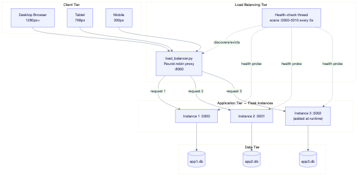

Four tiers:

1. **Client tier** — browsers at phone (390px), tablet (768px), and desktop (1280px+) widths.
2. **Load balancing tier** — `load_balancer.py` listening on `:8000`, plus a background health-check thread scanning ports 5000–5010 every 5 seconds.
3. **Application tier** — one or more identical Flask instances, each on its own port.
4. **Data tier** — one SQLite database file per instance.

> **Known limitation, by design.** Each backend owns a *separate* database file, so a session or cart may differ depending on which instance served the request. Production would share one database and/or use sticky sessions. Separate files were chosen deliberately to avoid SQLite write-lock contention while making instance-level routing visible.

### 3.3 Load Balancer Design

The load balancer is a Flask reverse proxy implementing three cloud concepts:

**Round-robin distribution.** An `itertools.count()` cycles requests across the healthy backend pool, so consecutive requests land on different instances.

**Health checking.** A daemon thread probes each candidate backend every `LB_HEALTH_INTERVAL` seconds (default 5) with a `LB_HEALTH_TIMEOUT` (default 2). Only responsive backends stay in rotation.

**Auto-scaling simulation.** Rather than a fixed backend list, the balancer *scans a port range* (default 5000–5010). Starting a new instance on any port in range adds it to rotation within one interval; stopping one evicts it. This models an auto-scaler adding and removing capacity. Setting `LB_TARGETS` switches to a static list and disables discovery.

**Correct proxy behavior.** Hop-by-hop headers (`connection`, `transfer-encoding`, `content-length`, etc.) are stripped rather than blindly forwarded, per RFC 7230.

**Graceful degradation.** With zero healthy backends the balancer returns **503 Service Unavailable** rather than crashing.

| Variable | Purpose | Default |
|---|---|---|
| `LB_PORT` | Port the balancer listens on | `8000` |
| `LB_PORT_RANGE_START` / `_END` | Port range scanned for backends | `5000` / `5010` |
| `LB_HEALTH_INTERVAL` | Seconds between scans | `5` |
| `LB_HEALTH_TIMEOUT` | Per-probe timeout | `2` |
| `LB_TARGETS` | Static backend list (disables discovery) | unset |

### 3.4 Application Structure

```
app/
  __init__.py       # create_app() factory, error handlers, flask create-admin CLI
  models.py         # User, Product, Tag, Review, Order, OrderItem, Complaint
  logger.py         # Shared AppLogger — leveled, key-value structured logging
  decorators.py     # @admin_required
  tag_utils.py      # Tag parsing / get-or-create helpers
  routes/
    auth.py         # register, login, logout, forgot/reset password
    main.py         # catalog + product detail (HTML)
    products.py     # JSON API
    cart.py         # cart operations + mock checkout
    orders.py       # history, detail, buy-again, returns, complaints
    reviews.py      # create / edit / delete reviews
    admin.py        # products, bulk add, users, order lookup, complaints
  templates/        # Jinja2 templates (incl. admin/ subfolder)
load_balancer/
  load_balancer.py  # Round-robin proxy with health checks + discovery
docs/
  architecture.md   # Mermaid diagram sources
  screenshots/      # Application screenshots and rendered diagrams
  slides/           # Final presentation (md / pdf / pptx)
scripts/
  capture_screenshots.py   # Regenerates docs/screenshots/
  browser_matrix_test.py   # Cross-browser + responsive verification
tests/              # pytest suite (131 tests)
config.py           # Environment-driven configuration
run.py              # Entry point (honors PORT)
```

The **application factory** (`create_app()`) accepts a `test_config` override, which is what allows the test suite to run against an in-memory database without touching development data.

The checkout path below shows how a request moves through the authorization,
CSRF, and validation gates before any order is written:

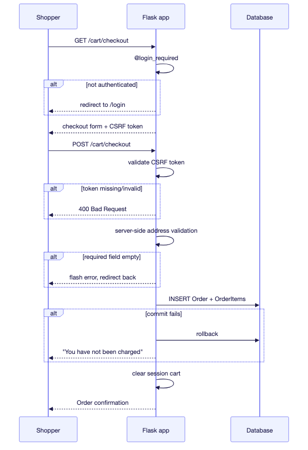

### 3.5 Environment Configuration

| Variable | Purpose | Default |
|---|---|---|
| `SECRET_KEY` | Signs session cookies, CSRF tokens, reset tokens | `dev` (must change) |
| `DATABASE_URL` | SQLAlchemy connection string | none — must be set |
| `PORT` | Port `run.py` binds to | `5000` |
| `LOG_LEVEL` | ERROR / WARN / NOTICE / INFO / DEBUG | `INFO` |
| `FLASK_APP` | Entry point for the `flask` CLI | `run.py` |

### 3.6 Environments

| Environment | Port | Access |
|---|---|---|
| Local development | 5000 | `http://localhost:5000` |
| Codio (cloud IDE) | 3000 | `https://<box-name>-3000.codio.io` |
| Docker container | 5000 | `http://localhost:5000` |
| Behind load balancer | 8000 | `http://127.0.0.1:8000` |

### 3.7 CI/CD Pipeline

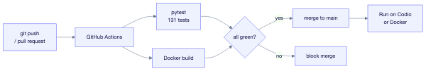

Every push and pull request to `main` triggers GitHub Actions to run the full pytest suite and build the Docker image. Both must pass before merge.

---

## 4. Challenges Encountered

### 4.1 Restructuring a Flat Script into an Application Factory

**Problem.** The project began as a 10-line `app.py`. Once authentication, models, and multiple route groups arrived, a single module could not hold them — and more importantly, it could not be tested, because importing the module immediately created a fully configured app bound to the development database.

**Resolution.** `app.py` was deleted and replaced with a package exposing `create_app()`, with `run.py` as the entry point, `config.py` for environment configuration, and `app/routes/` for blueprints. The factory accepts a `test_config` override.

**Outcome.** This single change is what made the 131-test suite possible; every test builds an isolated app against in-memory SQLite.

### 4.2 The Scaffold Dockerfile Did Not Match the Application

**Problem.** The course-provided Dockerfile targeted Python 3.8, exposed port 80, set a placeholder `ENV NAME World`, and ran `python app.py` — a file that no longer existed after the restructure.

**Resolution.** Rewritten for Python 3.12, port 5000, real environment variables, and `flask run --host=0.0.0.0` so the container accepts external connections.

### 4.3 `psycopg2-binary` Broke the Docker Build

**Problem.** The PostgreSQL driver needs build tooling absent from `python:3.12-slim`, so the image build failed — even though the container only uses SQLite.

**Resolution.** Requirements were split: `requirements.txt` for local/CI use, and `requirements-docker.txt` (identical minus `psycopg2-binary`) for the image, with a comment explaining exactly why the file exists. Adding compilers to the image would have bloated it to install a driver the container never loads.

### 4.4 Docker Layer Caching

**Problem.** The original Dockerfile copied the entire project before installing dependencies, so every source edit invalidated the cached `pip install` and forced a full reinstall.

**Resolution.** Copy `requirements-docker.txt` first, install, *then* copy source. Dependency installation now re-runs only when dependencies actually change.

### 4.5 `pytest` Not on PATH in CI

**Problem.** The CI job called `pytest -v` directly and failed — the console script was not on PATH in the runner.

**Resolution.** Changed to `python -m pytest -v`, which runs the module through the active interpreter and puts the project root on `sys.path`, so `import app` resolves.

### 4.6 Load Balancer: Static Lists vs. Real Auto-Scaling

**Problem.** A hardcoded backend list demonstrates round-robin but not elasticity — the interesting cloud property is capacity appearing and disappearing at runtime.

**Resolution.** A background thread scans a configurable port range and health-checks each candidate, so instances join and leave rotation automatically. `LB_TARGETS` remains available for a fixed list.

**Trade-off accepted.** Port scanning is a localhost simulation, not how real auto-scalers work (they use a service registry or cloud API). It was chosen because it demonstrates the *behavior* — dynamic membership driven by health — without external infrastructure.

### 4.7 SQLite Write Contention Across Instances

**Problem.** Pointing multiple backends at one SQLite file produced `database is locked` errors under concurrent writes; SQLite's single-writer model does not suit a multi-instance pool.

**Resolution.** Each instance gets its own database file (`app1.db`, `app2.db`, …). This trades data consistency for the ability to demonstrate load balancing — an explicitly documented limitation rather than a hidden bug. Production would use PostgreSQL, which the configuration already supports via `DATABASE_URL`.

### 4.8 Mobile Navigation Overflow *(found during final testing)*

**Problem.** Final-round responsive testing revealed the logged-in navigation bar overflowing on phone-width screens. At 375px the nav needed 552px against 343px of available width, pushing **"Logout" off the right edge** — the assignment's "colliding items / disappearing figures" case exactly. The `<meta name="viewport">` tag was present, but the stylesheet had **zero media queries**.

**Resolution.**
- `flex-wrap: wrap` on the nav so links wrap to a second line instead of clipping.
- A `max-width: 640px` media query that tightens spacing and hides the account email — the least useful nav item on a small screen.
- Wide admin tables wrapped in an `.table-scroll` container that scrolls horizontally *inside its own box* rather than stretching the page.

**Verification.** Nav overflow went from `true` to `false` at 375px, with no page-level horizontal overflow.

### 4.9 Form Inputs Overflowing Their Containers *(found during final testing)*

**Problem.** A page-by-page sweep found `/login`, `/register`, and `/admin/products/new` each 5px wider than the 375px viewport. The cause was the default `content-box` sizing model: inputs styled `width: 100%` *plus* `0.4rem` padding resolve to wider than their parent.

**Resolution.** A global `*, *::before, *::after { box-sizing: border-box; }` rule, so padding counts inside declared widths. One rule fixed all three pages.

**Related.** `/products/1` overflowed to 412px because the hero image carried an inline `max-width: 400px` that overrode the stylesheet's `img { max-width: 100% }`. Changed to `width: 100%; max-width: 400px` so it scales down on narrow screens and still caps on wide ones.

### 4.10 Slow Catalog Load on Poor Connections *(found during final testing)*

**Problem.** Throttled to Slow 3G (400 kbps, 400 ms RTT), the catalog took **5.83 seconds** to load — nine full-size remote product images all fetched eagerly, including those far below the fold.

**Resolution.** Added `loading="lazy"` and `decoding="async"` to catalog and cart thumbnails, deferring off-screen images. The product detail hero remains eager since it is the page's primary content.

**Outcome.** Catalog load on Slow 3G dropped from **5,834 ms to 968 ms — an 83% improvement** — with no change to the visible layout.

---

## 5. Testing and Debugging

Testing ran at four levels: automated unit/integration tests, cross-browser automation, manual exploratory testing, and infrastructure testing of the load balancer.

### 5.1 Automated Test Suite — pytest

**131 tests, all passing.**

```
$ python -m pytest -q
........................................................................ [ 54%]
...........................................................              [100%]
131 passed, 55 warnings in 9.54s
```

| Test module | Covers |
|---|---|
| `test_auth.py` | Registration, login, logout, password reset tokens |
| `test_main.py` | Catalog rendering, product detail, tag filtering |
| `test_products.py` | JSON API CRUD, field whitelisting, validation |
| `test_reviews.py` | Rating bounds, one-review-per-user constraint, edit/delete |
| `test_orders.py` | Checkout, order history, ownership enforcement, returns |
| `test_admin.py` | Admin gating, product management, user promotion |
| `test_logger.py` | Log level handling and structured output |
| `test_flow_logging.py` | Vital user flows emit correct log events |

Tests run against **in-memory SQLite with CSRF disabled**, via fixtures in `tests/conftest.py`, so they never touch development data. The same suite runs in GitHub Actions on every push and PR.

### 5.2 Cross-Browser and Responsive Testing — Playwright

A dedicated harness (`scripts/browser_matrix_test.py`) drives a **real purchase flow in three engines** and checks every page for layout overflow at three widths.

**Result: 99/99 checks passed.**

| Engine | Represents | Purchase flow | Error handling | 403 enforcement | Responsive |
|---|---|---|---|---|---|
| Chromium | Chrome, Edge | Pass | Pass | Pass | Pass |
| Firefox | Firefox | Pass | Pass | Pass | Pass |
| WebKit | Safari | Pass | Pass | Pass | Pass |

Per engine the harness verifies: login succeeds with valid credentials; **invalid credentials show "Invalid email or password."**; items add to the cart; **an empty checkout form is rejected**; a complete order is placed; and **requesting another user's order returns 403**. It then sweeps 9 pages at 390px, 768px, and 1280px asserting no horizontal overflow — 27 layout assertions per engine.

> **Note on Edge.** Edge and Chrome share the Chromium engine, so Chromium coverage represents both. Safari is covered through WebKit, its actual engine.

### 5.3 Manual Testing — Feature Walkthrough

Every feature was exercised by hand as a user would.

| Test | Input | Expected | Result |
|---|---|---|---|
| Login — valid | `shopper@example.com` / correct | Logged in, redirect to catalog | Pass |
| Login — wrong password | correct email / `wrongpassword` | "Invalid email or password." | Pass |
| Login — invalid email format | `abc123` | Browser blocks; server rejects | Pass |
| Login — CSRF token stripped | POST without token | **HTTP 400** | Pass |
| Register — short password | 5 characters | "Password must be at least 8 characters." | Pass |
| Register — duplicate email | existing address | "Email already registered." | Pass |
| Catalog | — | 9 products, images, tags, prices | Pass |
| Tag filter | click a tag | Filters to matching products | Pass |
| Product detail | product 1 | Image, description, stock, 4.7 avg rating | Pass |
| Add to cart | qty 1 and qty 2 | Badge shows 3; totals correct | Pass |
| Cart math | $199.99 + 2 × $79.00 | **$357.99** | Pass |
| Checkout — empty form | submit blank | Blocked client-side; rejected server-side | Pass |
| Checkout — valid | full address + card | "Thank you for your order!" | Pass |
| Order history | — | Both orders with dates and totals | Pass |
| Order detail | order 1 | Items, address, Buy Again, Return, Complaint | Pass |
| **Order of another user** | `/orders/3` as shopper | **403 Forbidden** | Pass |
| Admin — users | as admin | 5 users, promote buttons | Pass |
| Admin — gating | admin URL as shopper | Access denied | Pass |
| Password reset | request link | Signed URL written to log | Pass |

### 5.4 Responsive and Layout Testing

Every documented page was measured for horizontal overflow at three widths. Issues found were fixed (§4.8–4.9) and re-verified.

| Width | Device class | Pages checked | Before fixes | After fixes |
|---|---|---|---|---|
| 375–390px | Phone | 12 | 4 overflowing | **0** |
| 768px | Tablet | 12 | 0 | **0** |
| 1280px | Desktop | 12 | 0 | **0** |

Overflow was measured programmatically (`document.documentElement.scrollWidth > viewport width`) rather than judged by eye, so results are reproducible.

| Page | Issue found | Fix | Verified |
|---|---|---|---|
| All (logged in) | Nav overflowed 552px into 343px; "Logout" clipped | `flex-wrap` + media query hiding account email | Pass |
| `/login`, `/register`, `/admin/products/new` | 380px vs 375px viewport | Global `box-sizing: border-box` | Pass |
| `/products/1` | 412px — hero image inline `max-width` | `width: 100%; max-width: 400px` | Pass |
| `/admin/users`, `/admin/complaints` | 4-column tables stretched page | `.table-scroll` container | Pass |

### 5.5 Performance Testing

**Server response times** (local, warm):

| Page | Response time | HTML size |
|---|---|---|
| `/` (catalog) | 5 ms | 28.0 KB |
| `/products/1` | 3 ms | 8.7 KB |
| `/login` | 1 ms | 4.2 KB |
| `/admin/users` | 1 ms | 3.4 KB |

**Throttled connection** (Chrome DevTools protocol, Slow 3G — 400 kbps, 400 ms RTT):

| Page | Before optimization | After lazy loading | Improvement |
|---|---|---|---|
| `/` (catalog, 9 images) | 5,834 ms | **968 ms** | **83% faster** |

The optimization was `loading="lazy"` on below-the-fold thumbnails (§4.10). No page approaches problematic load times; the slowest real-world case is now under one second on a deliberately poor connection.

### 5.6 Load Balancer / Infrastructure Testing


| Scenario | Method | Expected | Result |
|---|---|---|---|
| Round-robin distribution | 8 requests, 2 backends | Alternating backends | Pass — perfect alternation (6/5 split) |
| **Scale up** | Start 3rd backend at runtime | Joins within one interval | Pass — `Backend(s) up: ['…:5003']`, traffic spans 3 |
| **Scale down** | Kill the 3rd backend | Evicted from rotation | Pass — `Backend(s) down: ['…:5003']` |
| **Total failure** | Kill all backends | 503, no crash | Pass — **HTTP 503** |
| Health checking | Probe interval | Only live backends serve | Pass |

This is the clearest demonstration of the cloud concepts in the project: capacity joined and left the pool at runtime with no configuration change and no restart.

### 5.7 Debugging Notes

**Stale process masking template changes.** During responsive work, edits to `base.html` appeared to have no effect — the served HTML lacked the new `@media` blocks even after a restart. The cause was an orphaned server process still holding port 5055 that a too-narrow `pkill` pattern had missed; the "restarted" server never actually bound. Diagnosed with `lsof -ti :5055`, which showed a PID that `ps | grep "python run.py"` did not match. **Lesson:** verify a restart by the port's owner, not by the absence of a matching process name.

**Client-side validation is not validation.** The checkout form's HTML5 `required` attributes were verified, but the same fields are independently re-validated server-side, since any client can post arbitrary data. Both layers were tested separately.

**Measure, don't eyeball.** The nav overflow was invisible in an early screenshot because the browser had zoomed the page to fit, reporting a 568px viewport for a 375px device. Measuring `nav.scrollWidth` against `nav.clientWidth` exposed the real clipping. Programmatic measurement caught what a visual check missed.

### 5.8 Test Reproduction

```bash
# Unit/integration suite
python -m pytest -v

# Cross-browser + responsive matrix (requires a running instance)
pip install playwright && python -m playwright install
DATABASE_URL=sqlite:///demo.db PORT=5055 python run.py &
python scripts/browser_matrix_test.py

# Regenerate documentation screenshots
python scripts/capture_screenshots.py
```

> Playwright is a documentation- and testing-time tool. It is deliberately **not** in `requirements.txt`, so the application's runtime dependencies stay minimal.

---

## 6. Screenshots

### Storefront

**Product catalog** — grid layout, tag filtering, live cart badge.
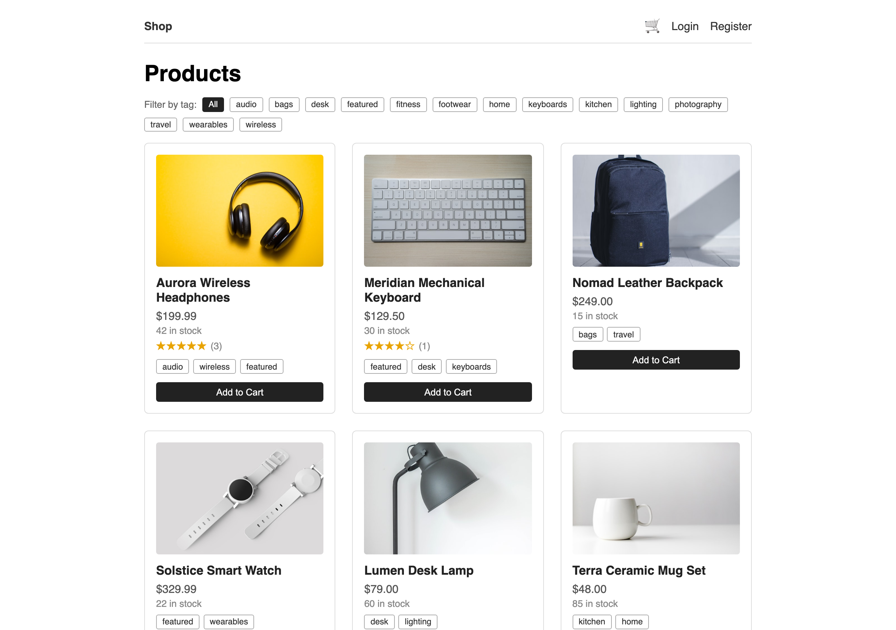

**Product detail** — imagery, stock, tags, and aggregated star ratings with reviews.


**Shopping cart** — quantity updates, per-line totals, running total.
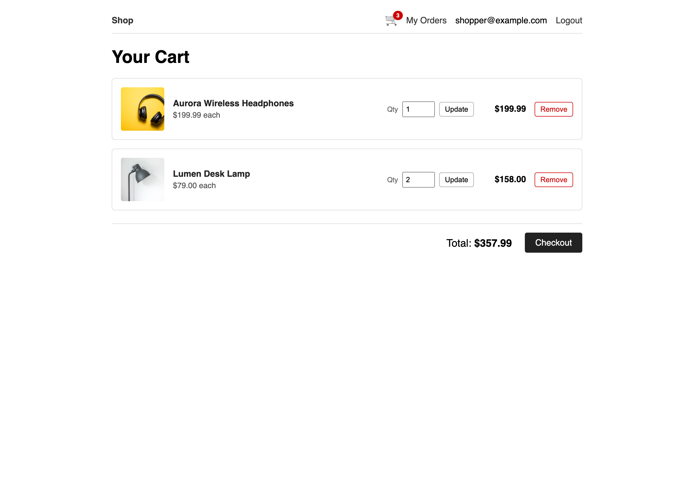

**Checkout** — shipping form and order summary, clearly labeled as a mock payment.
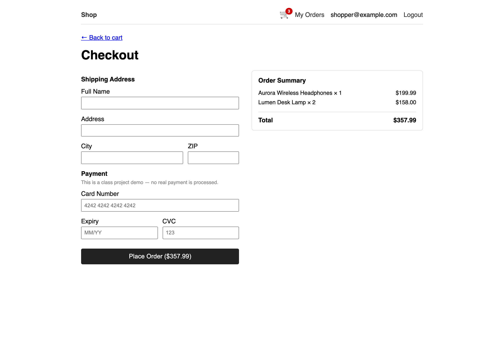

**Order detail** — items, shipping address, Buy Again, returns, and complaints.
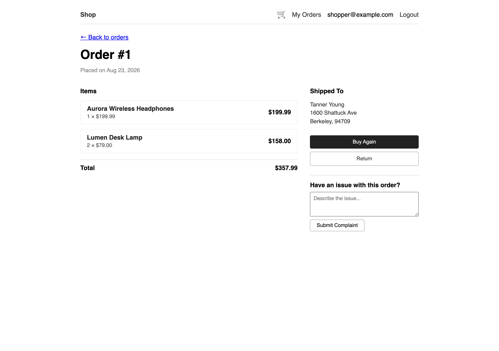

**Order history** — past orders with dates and totals.
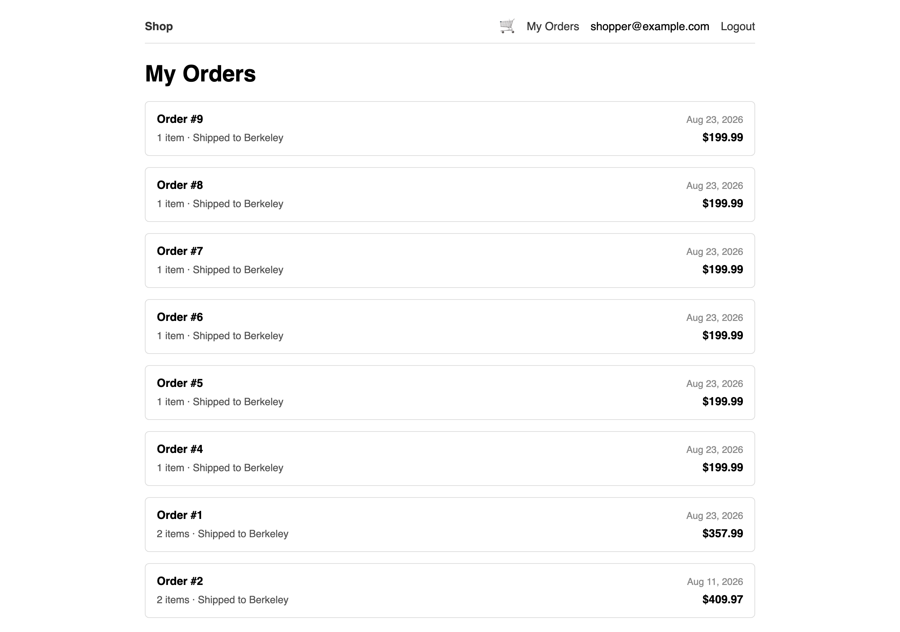

### Administration

**User management** — role visibility and promotion to admin.
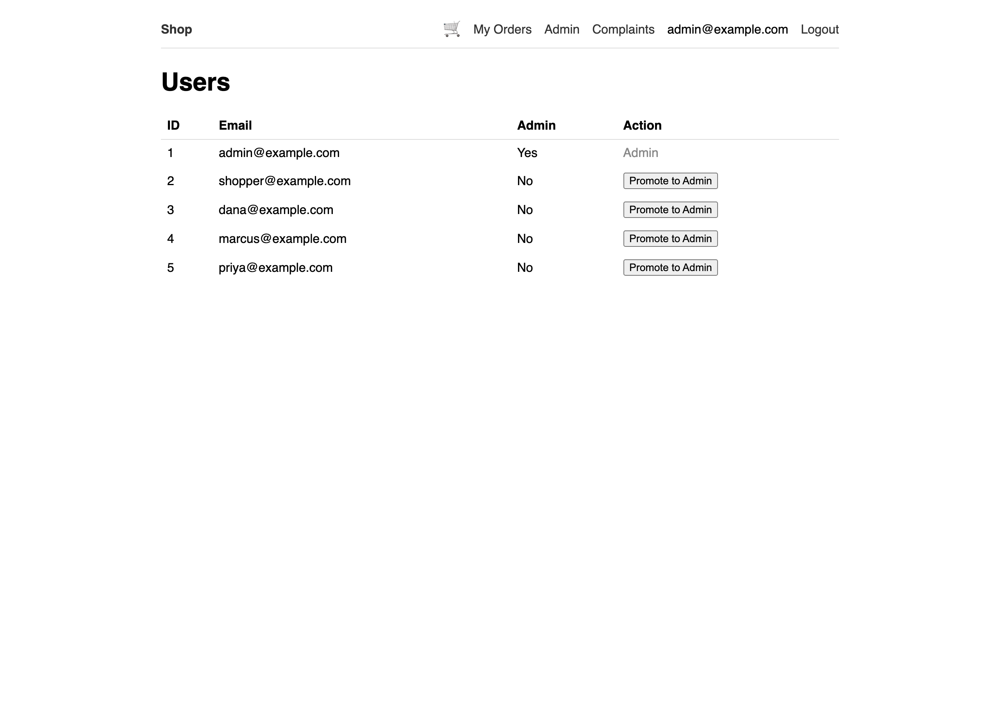

**Product management** — create/edit products, with bulk creation for test data.
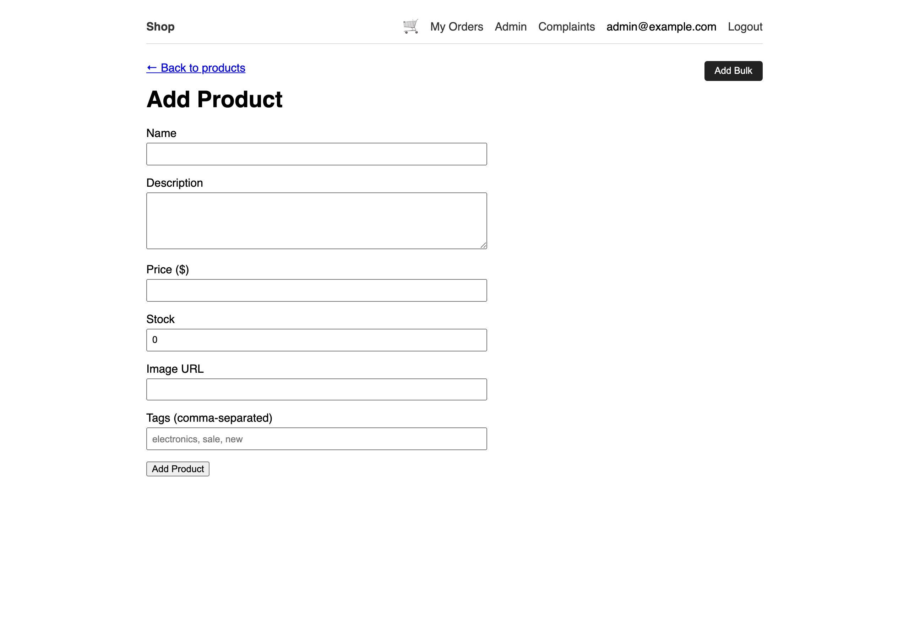

### Validation and Error Handling

**Invalid login** — a clear error that does not reveal whether the email exists.
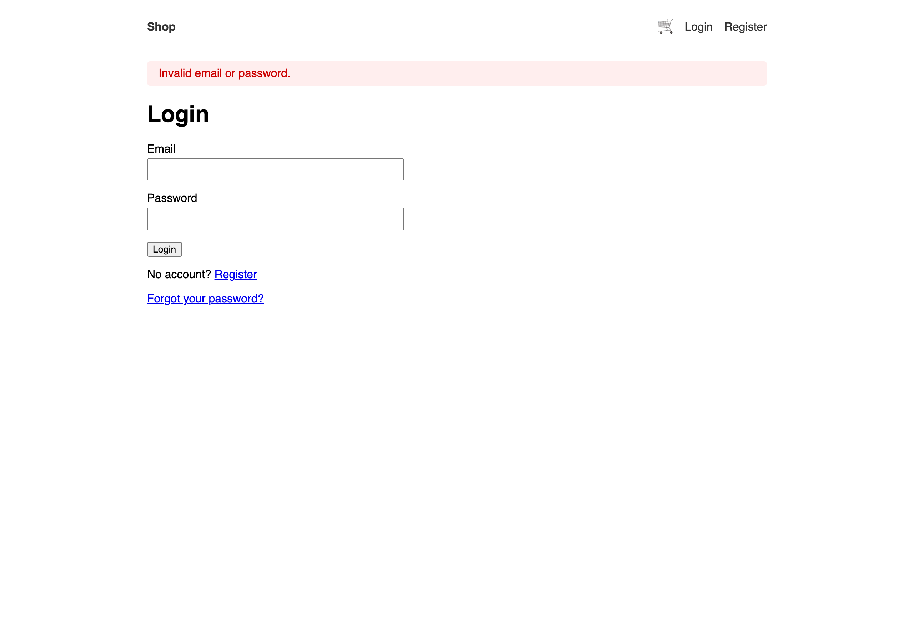

### Responsive Layout

**Catalog on mobile (390px)** — the grid reflows to a single column.
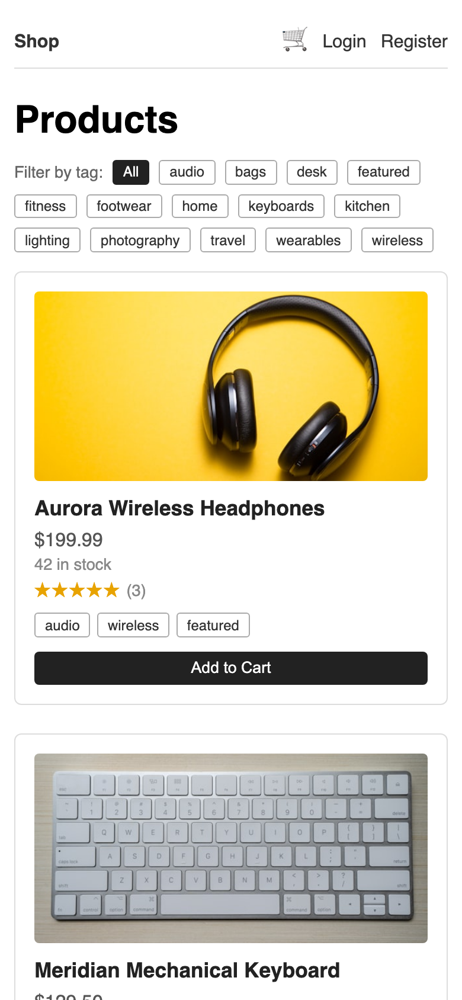

**Cart on mobile** — line items stack and remain fully usable.
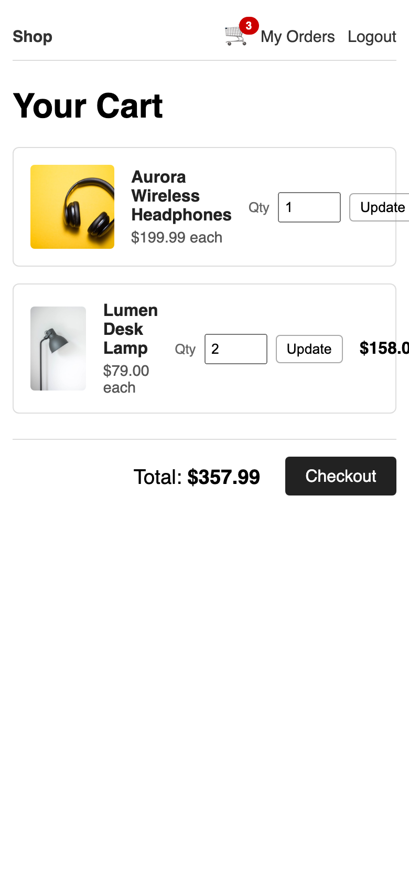

**Admin table on mobile** — nav wraps instead of clipping; the wide table scrolls inside its own container.
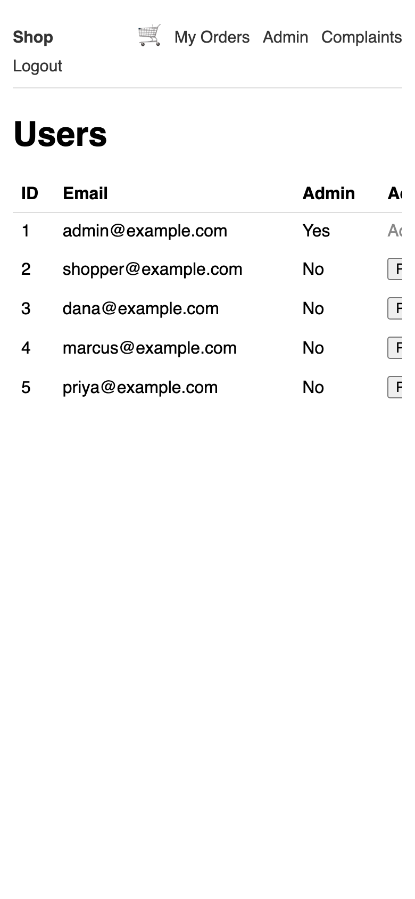

### Cloud Infrastructure

**Load balancer** — round-robin distribution with a backend joining and leaving the pool at runtime.


---

## 7. Running the Project

Condensed; see [`README.md`](README.md) for full instructions.

```bash
# Setup
python -m venv venv && source venv/bin/activate
pip install -r requirements.txt
cp .env.example .env          # set SECRET_KEY and DATABASE_URL

# Bootstrap the first admin, then run
flask create-admin admin@example.com
flask run --debug             # http://localhost:5000
```

**Behind the load balancer:**

```bash
PORT=5000 DATABASE_URL=sqlite:///app1.db python run.py &
PORT=5001 DATABASE_URL=sqlite:///app2.db python run.py &
python load_balancer/load_balancer.py          # http://127.0.0.1:8000
```

Start another instance on any port in 5000–5010 and it joins rotation automatically.

---

## 8. Use of AI Assistance

AI assistance (Claude) was used throughout this project. This section describes where and how, so the origin of the work is clear.

### Where AI was used

- **Exploring features and deciding on pathways.** Weighing implementation options — how to structure the load balancer's backend discovery, whether to enforce one-review-per-user in application code or as a database constraint, how to split requirements for the Docker build — and talking through the trade-offs before committing to an approach.
- **Writing code.** Generating implementations from my direction, across the storefront, admin area, load balancer, and test suite.
- **Testing and debugging.** Instrumented testing during the final round, including the cross-browser matrix and the responsive measurements that surfaced the navigation overflow and form sizing bugs.
- **Polishing documentation.** Drafting and structuring this document, the README, the architecture diagrams, and the presentation deck.

### How the work was directed and reviewed

I set the direction: what to build, which approach to take when there were options, and what was acceptable to commit. I reviewed generated code and documentation, revised it where it did not match my intent, and made the final call on every commit. Work that did not hold up was changed or discarded before it landed.

The engineering decisions this project is meant to demonstrate — the four-tier architecture, the auto-scaling simulation via port scanning, one database per instance to sidestep SQLite write contention, security as a first-class concern from the first authentication commit — are mine, arrived at over roughly five months of development.

### Why this is disclosed

Two reasons. First, so the record of how this project was built is accurate. Second, because some of this document reconstructs the reasoning behind decisions made months earlier; a reader should know which parts are contemporaneous record and which are later reconstruction, and weight them accordingly.

---

## Appendix: Summary of Final-Round Changes

Issues found during final testing and fixed before submission:

| # | Issue | Severity | Fix | Verified by |
|---|---|---|---|---|
| 1 | Nav overflowed on phones; "Logout" clipped | High — control unreachable | `flex-wrap` + media query | 27 layout assertions × 3 engines |
| 2 | Login/register/product forms 5px over viewport | Medium | Global `box-sizing: border-box` | Overflow sweep |
| 3 | Product hero image forced 412px width | Medium | Fluid `width: 100%` with cap | Overflow sweep |
| 4 | Admin tables stretched the page | Medium | `.table-scroll` container | Overflow sweep |
| 5 | Catalog took 5.8s on Slow 3G | Medium — perceived performance | Lazy-loaded thumbnails | Throttled re-measurement (968 ms) |

**Final state:** 131 pytest tests passing, 99/99 cross-browser checks passing, zero horizontal overflow across 12 pages at 3 viewport widths, and a load balancer verified through scale-up, scale-down, and total-failure scenarios.
