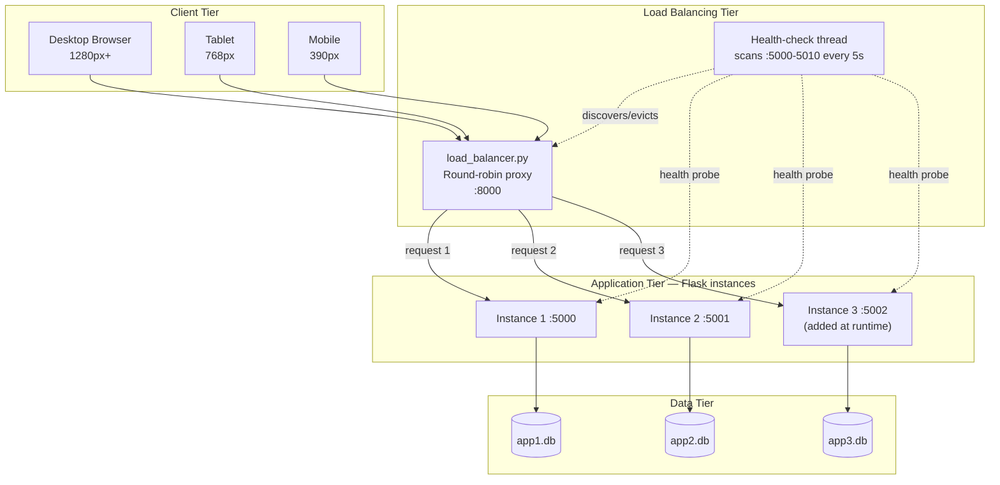
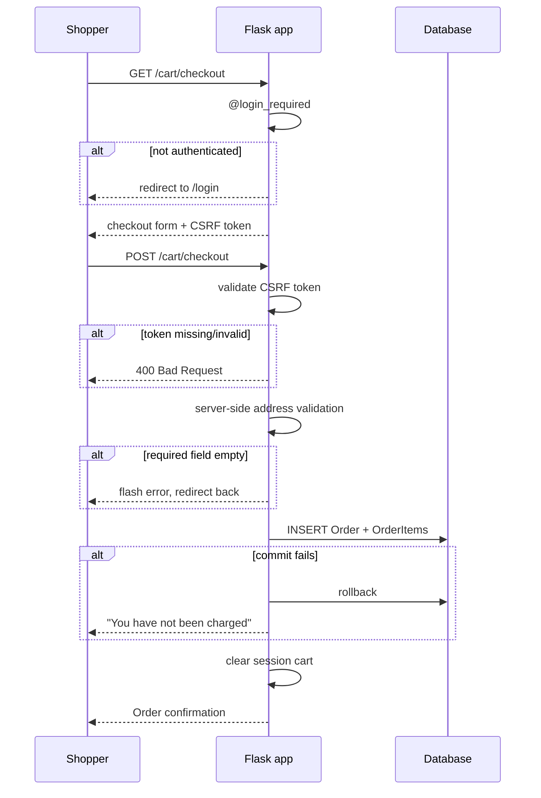
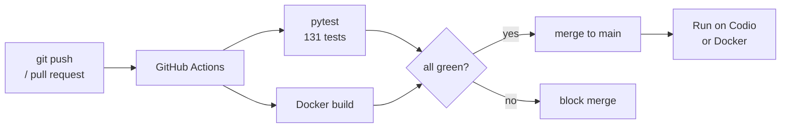

# Architecture Diagrams

Source diagrams for the project documentation. GitHub renders Mermaid natively.

## 1. System Architecture

## 2. Application Structure (Flask blueprints)

```mermaid
graph LR
    subgraph factory["create_app() — app/__init__.py"]
        CFG["config.py<br/>env-driven"]
        LOG["AppLogger<br/>app/logger.py"]
        ERR["403 / 404 / 500<br/>handlers"]
        CLI["flask create-admin"]
    end

    subgraph bp["Blueprints — app/routes/"]
        AU["auth.py<br/>register, login, reset"]
        MA["main.py<br/>catalog, detail"]
        PR["products.py<br/>JSON API"]
        CA["cart.py<br/>cart, checkout"]
        OR["orders.py<br/>history, returns"]
        RV["reviews.py<br/>ratings"]
        AD["admin.py<br/>back office"]
    end

    subgraph models["Models — app/models.py"]
        M["User · Product · Tag<br/>Review · Order<br/>OrderItem · Complaint"]
    end

    factory --> bp
    bp --> models
    models --> DB[("SQLAlchemy<br/>SQLite / PostgreSQL")]
```

## 3. Checkout Flow (with security gates)

## 4. CI/CD Pipeline

