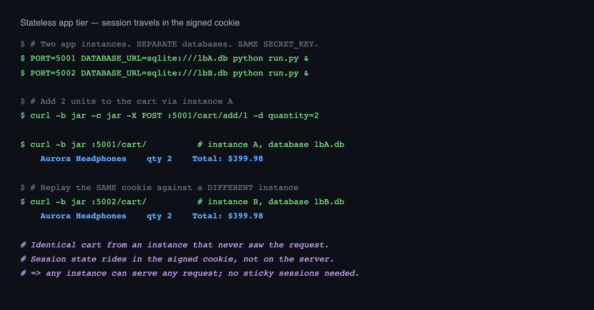

# Slide 1 — The Cloud Problem and the Approach

## The Problem Cloud Architecture Solves Here

A storefront on one server fails at exactly the wrong moment: a product gets featured, traffic spikes 10x, and the busiest hour becomes the hour customers cannot buy. Vertical scaling is capacity you pay for year-round and still outgrow in a spike.

**The cloud answer is horizontal:** many small identical instances behind a load balancer, added and removed as demand moves.

## What That Requires of the Application

Horizontal scaling is not a deployment trick — it constrains how the app is written. Three properties had to hold:

| Requirement | Why it matters | How it was met |
|---|---|---|
| **Stateless app tier** | Any instance must serve any request | Session in a signed cookie, not server memory |
| **Externalized config** | One image, many environments | All config from environment variables |
| **Health-reporting instances** | The balancer must know who is alive | HTTP probe per instance every 5s |

## Cloud Concepts Implemented

**Load balancing** · **health checking** · **auto-scaling simulation** · **stateless application tier** · **CDN-offloaded assets** · **role-based access control** · **containerization** · **CI/CD**

Each is covered in the slides that follow, with the trade-offs stated rather than hidden.

---

# Slide 2 — Load Balancer and Elastic Capacity

## Design

`load_balancer/load_balancer.py` — a Flask reverse proxy on `:8000` implementing four behaviors:

| Behavior | Implementation |
|---|---|
| **Round-robin** | `itertools.count()` cycles the healthy pool |
| **Health checking** | Daemon thread probes each backend every 5s, 2s timeout |
| **Auto-scaling** | Scans ports 5000–5010; instances join/leave on their own |
| **Retry on failure** | A request to a dead backend re-dispatches to the next |

Hop-by-hop headers (`connection`, `transfer-encoding`, `content-length`) are stripped per RFC 7230 rather than blindly forwarded.

## Failure Behavior

| Condition | Response |
|---|---|
| Backend dies mid-request | Retry next target; client never sees the failure |
| All retries exhausted | `502 Bad Gateway` |
| Zero healthy backends | `503 Service Unavailable` — degrades, does not crash |

## Verified Live


A third instance joins a running pool in one health interval and leaves when killed — **no restart, no config change.**

---

# Slide 3 — Stateless Tier and Fast Image Delivery

## Why the App Tier Is Stateless

Round-robin only works if any instance can serve any request. Flask sessions are **signed client-side cookies**, so cart and login state travel *with* the request rather than living on one server.

The proof: a cart built on instance A, read back from instance B — a different process with a **different database** — returns the identical cart.



This is why the deployment needs **no sticky sessions**. `SECRET_KEY` is shared across instances; any of them can verify the signature.

## Fast Image Loading

Product images are **remote URLs, never served by the app** — the application ships zero binary assets, so image bandwidth never touches the instances or the load balancer. That is CDN offload in practice.

Delivery was then tuned in the browser:

| Technique | Effect |
|---|---|
| `loading="lazy"` | Below-the-fold images deferred until scrolled toward |
| `decoding="async"` | Decode off the main thread; no render block |

**Measured on throttled Slow 3G (400 kbps, 400 ms RTT):**

| Metric | Before | After |
|---|---|---|
| Catalog load (9 images) | 5,834 ms | **968 ms — 83% faster** |

---

# Slide 4 — Security and Role-Based Access Control

## Roles: How They Work

A single `is_admin` flag on `User`, enforced by an `@admin_required` decorator that aborts with **403** for anyone unauthenticated or non-admin.

```
def admin_required(f):
    @wraps(f)
    def decorated_function(*args, **kwargs):
        if (not current_user.is_authenticated
                or not current_user.is_admin):
            abort(403)
        return f(*args, **kwargs)
    return decorated_function
```

**Coverage:** 12 admin-gated routes · 10 login-gated routes.

## Four Tiers of Authorization

| Tier | Rule | Example |
|---|---|---|
| Public | No auth | Catalog, product detail |
| Authenticated | `@login_required` | Cart, checkout, order history |
| **Ownership** | Must own the record | `/orders/<id>` — **403 on another user's order** |
| Admin | `@admin_required` | Product CRUD, user promotion, complaints |

**Ownership is checked, not just login.** A logged-in user requesting another's order is refused — verified in all three browser engines.

## Bootstrapping the First Admin

Registration never sets `is_admin`, and the promotion UI is itself admin-gated — so a fresh database has no path to an admin through the web. `flask create-admin <email>` breaks the cycle from the CLI. **No privilege escalation path exists through the application.**

## Defense in Depth

**CSRF** on every state-changing POST — a missing token returns 400 · **PBKDF2-SHA256** password hashing, 8-char minimum · **Field whitelisting** blocks mass assignment · **Signed, single-use, 1-hour** reset tokens · **Identical response** for known and unknown emails, preventing account enumeration

---

# Slide 5 — SQLite Today, Managed Cloud Database Next

## Why SQLite Is the Current Data Tier

Pointing several instances at one SQLite file produced `database is locked` under concurrent writes — SQLite allows a single writer. Each instance therefore owns its **own database file**.

This was the deliberate trade-off:

| Gained | Given up |
|---|---|
| Multi-instance load balancing runs anywhere, zero setup | Data is **per-instance**, not shared |
| No external service to provision for a course demo | Order written on A is invisible on B |

**Stated plainly rather than hidden:** the app tier scales correctly; the *data* tier is the deliberate simulation boundary of this project.

## Why the Application Is Already Portable

The constraint is the storage engine, not the code. SQLAlchemy abstracts the dialect and **the connection string is already an environment variable**:

```
DATABASE_URL=sqlite:///app1.db                      # today
DATABASE_URL=postgresql://user:pw@rds-host/shop     # one variable away
```

`psycopg2-binary` already ships in `requirements.txt`. **No application code changes to move to PostgreSQL.**

## Future Improvement: Managed Cloud Database

| Step | Change | Unlocks |
|---|---|---|
| 1 | Point every instance at one managed PostgreSQL (RDS/Cloud SQL) | **Shared state** — any instance serves any user identically |
| 2 | Enable `Flask-Migrate` (already a dependency) | Versioned schema across deploys |
| 3 | Add a read replica | Read scaling for the catalog |
| 4 | Move sessions to Redis | Server-side revocation, larger session payloads |

Step 1 alone removes the only limitation on this slide — and it is a configuration change, not a rewrite.

## Verified End to End

**131 pytest tests** · **99/99 cross-browser checks** (Chromium, Firefox, WebKit) · **zero layout overflow**, 12 pages × 3 widths · **load balancer**: round-robin, scale-up, scale-down, 502 retry, 503 total failure

**Repository:** https://github.com/tlycode/tanner-young-cloud-project
