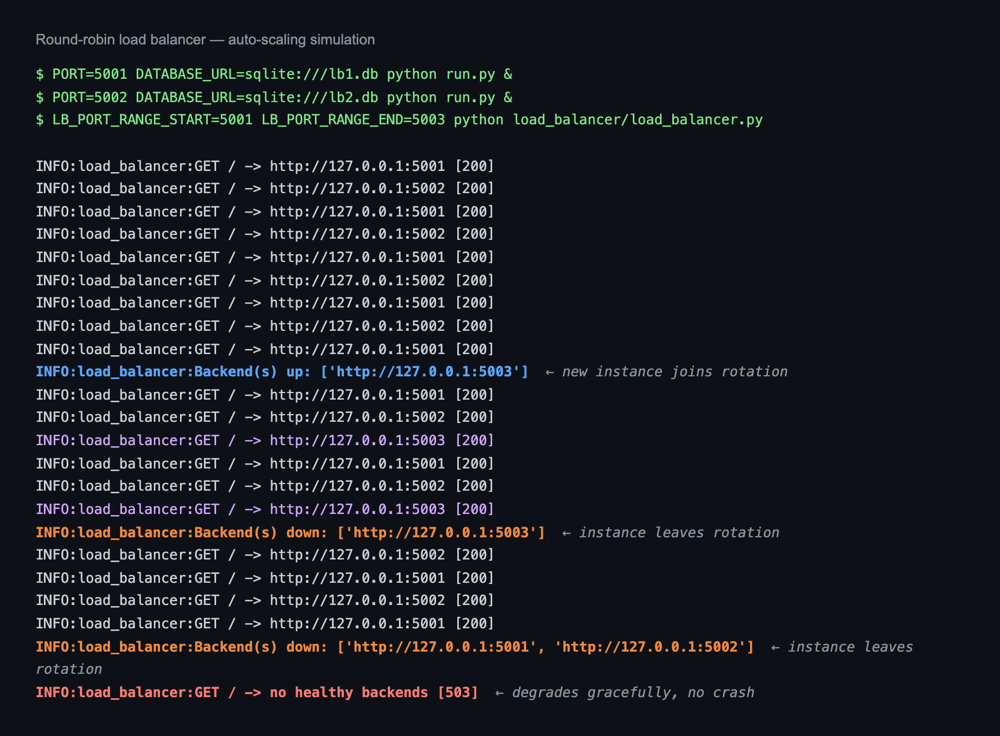

# Slide 1 — The Problem, the Customer, the Value

## The Problem

Small online sellers get punished for their best days.

A hosted storefront on a single server handles an ordinary Tuesday fine. Then a product gets featured, a post takes off, a holiday lands — traffic spikes 10x and the site slows, times out, or falls over. **The busiest hour of the year becomes the hour customers cannot buy.**

The usual escape routes both cost real money: pay year-round for capacity you need twice a year, or rebuild on a platform that takes 3% of every sale forever.

## Ideal Customer Profile

| | |
|---|---|
| **Who** | Independent sellers — 10 to 500 SKUs, 1–3 person team |
| **Revenue** | $50K–$2M annually |
| **Traffic** | Spiky: quiet baseline, sharp promotional peaks |
| **Pain** | Downtime during peaks; margin lost to platform fees |
| **Technical depth** | Comfortable deploying, no dedicated DevOps staff |

## Value Proposition

**Capacity that follows demand, on infrastructure you own.**

- **Scales horizontally under load** — add an instance and it serves traffic within 5 seconds, no restart, no config change
- **Degrades gracefully** — a failed instance leaves rotation automatically; the storefront stays up
- **Owned, not rented** — runs on any host; no per-transaction fee
- **Complete out of the box** — catalog, reviews, cart, checkout, orders, returns, and an admin back office

---

# Slide 2 — Methods and Features

## How It Was Built

**Approach:** server-rendered Flask, built in five phases over ~5 months — scaffold, foundation, storefront, depth, cloud. CI enforced from phase 2: every push runs the test suite and a Docker build.

**Why server-rendered rather than a SPA:** every page load is a real HTTP request, so routing through the load balancer to a specific instance is directly observable — the property the project exists to demonstrate.

**Stack:** Python 3.12 · Flask 3.x · SQLAlchemy · Flask-Login · Jinja2 · pytest · Docker · GitHub Actions

## What It Does

| Area | Capability |
|---|---|
| **Accounts** | Registration, login, signed single-use password reset |
| **Catalog** | Products, images, many-to-many tag filtering, JSON API |
| **Reviews** | 1–5 star ratings, one per user per product, editable |
| **Cart** | Session-backed, live badge, quantity updates |
| **Checkout** | Address + mock payment — no card data stored |
| **Orders** | History, detail, Buy Again, returns, complaints |
| **Admin** | Product CRUD, bulk seeding, user promotion, complaints queue |
| **Infrastructure** | Round-robin load balancer, health checks, auto-discovery |

## Security, Built In From the Start

CSRF on every state-changing POST · PBKDF2-SHA256 password hashing · field whitelisting against mass assignment · **ownership-checked orders — not merely login-checked** · role-gated admin via `@admin_required`

---

# Slide 3 — Code Review, Challenges, Solutions

## Architecture Decisions Under Review

| Decision | Why | Trade-off accepted |
|---|---|---|
| `create_app()` factory | Injectable test config | More indirection than a flat module |
| One DB per instance | SQLite locks under concurrent writes | Data differs per instance — documented, not hidden |
| Port-range scanning | Shows dynamic membership without extra infra | A simulation; real systems use a service registry |
| Split requirements files | `psycopg2` needs compilers the image lacks | Two files to keep in sync |

## Challenges and How They Were Solved

**A flat `app.py` could not be tested.** Importing it built a live app bound to the dev database. Restructured into an application factory accepting a test config — the change that made all 131 tests possible.

**A static backend list demonstrated nothing.** Round-robin across fixed targets shows distribution but not elasticity. Added a health-check thread scanning a port range, so instances join and leave rotation on their own.

**SQLite locked under multi-instance writes.** Gave each backend its own database file — an explicit trade-off, documented in the README rather than buried.

**Docker rebuilt dependencies on every source edit.** Reordered the Dockerfile: copy requirements → install → *then* copy source.

## Caught in Final Review

The stylesheet had a viewport meta tag but **zero media queries**. On a 375px screen the nav needed 552px against 343px available — **"Logout" was clipped off-screen and unreachable.**

It survived earlier passes because a screenshot *looked* fine: the browser zoomed out to fit, reporting a 568px viewport for a 375px device. Measuring `scrollWidth` against `clientWidth` exposed it. **Verify by measurement, not by eye.**

---

# Slide 4 — From Defect to Verified Fix

## Five Issues Found, Fixed, and Re-Verified

| # | Issue | Impact | Fix |
|---|---|---|---|
| 1 | Nav overflowed; **"Logout" clipped** | Control unreachable on mobile | `flex-wrap` + media query |
| 2 | Forms 5px past viewport | Horizontal scroll on 3 pages | Global `box-sizing: border-box` |
| 3 | Hero image forced 412px | Horizontal scroll | Fluid width with a cap |
| 4 | Admin tables stretched page | Horizontal scroll | Dedicated scroll container |
| 5 | Catalog **5.8s** on Slow 3G | Perceived performance | Lazy-loaded thumbnails |

## Two Root Causes, Not Five Bugs

Issues 2–4 share one cause: the default `content-box` model, where `width: 100%` plus padding exceeds the parent. **One line — `box-sizing: border-box` — fixed three pages.**

Issue 5 was nine full-size images fetched eagerly, including those far below the fold.

## Measured Outcome

| Metric | Before | After |
|---|---|---|
| Catalog load, Slow 3G | 5,834 ms | **968 ms** (83% faster) |
| Pages overflowing at 375px | 4 of 12 | **0 of 12** |
| Nav overflow at 375px | 552px into 343px | **No overflow** |

Every fix was re-verified by the same instrumented measurement that found it — not by looking again.

---

# Slide 5 — Proof: Elastic Capacity in Action

## The Claim, Demonstrated

Slide 1 promised capacity that follows demand. This is that behavior, captured live — a third instance joining and leaving a running pool with **no restart and no configuration change**.

## What the Log Shows

| Phase | Event | Behavior |
|---|---|---|
| Steady state | 2 backends | Requests alternate 5001 / 5002 |
| **Scale up** | Instance started on :5003 | Detected in one 5s interval, joins rotation |
| **Scale down** | :5003 killed | Evicted; traffic returns to 2 backends |
| **Total failure** | All backends down | **HTTP 503** — degrades, does not crash |

## Verification at Four Levels

| Level | Method | Result |
|---|---|---|
| Unit / integration | pytest, in-memory SQLite | **131 passing** |
| Cross-browser | Real purchase flow: Chromium, Firefox, WebKit | **99/99 passing** |
| Responsive | `scrollWidth` measured, 12 pages × 3 widths | **Zero overflow** |
| Infrastructure | Scale up, scale down, total failure | **All scenarios pass** |

## Bottom Line

A small seller's storefront **survives its best day** — capacity joins in seconds, failure is absorbed rather than propagated, and every claim here is backed by a test that can be re-run.

**Repository:** https://github.com/tlycode/tanner-young-cloud-project
